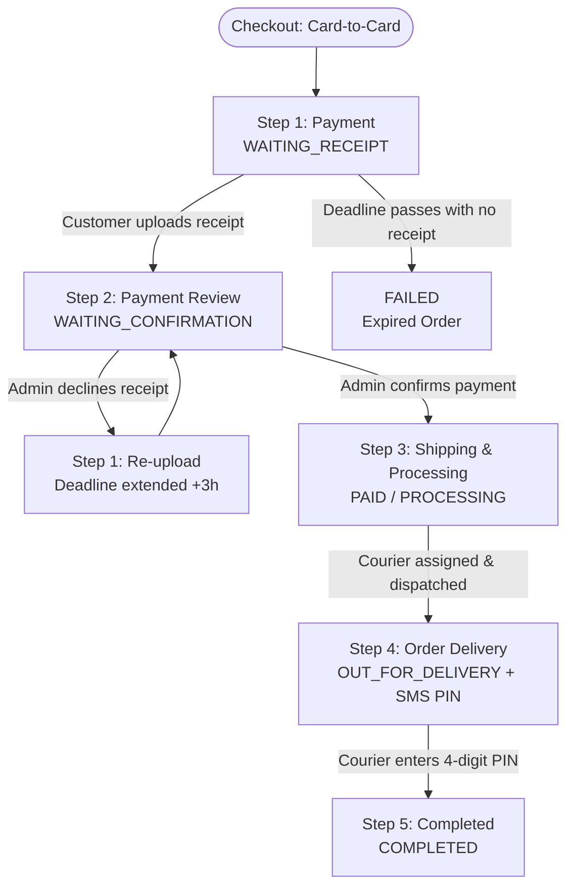

# Invoice Flow & Status Lifecycle

Comprehensive technical reference for human developers and AI assistants regarding the invoice and order management lifecycle across customer dashboard and admin panels.

---

## 1. Overview & Core Architecture

Every customer purchase in the system revolves around the `App\Models\Invoice` model. An invoice can be paid online via gateway or offline via bank card-to-card transfer.

### Relevant Models & Services
- **`App\Models\Invoice`**: Core order record storing financial totals, status, shipping address, transport method, and metadata.
- **`App\Models\Payment`**: Associated payment attempt records (`CARD`, `ONLINE`, `CASH`, `CREDIT`, etc.).
- **`App\Models\PaymentReceipt`**: Uploaded receipt images or PDFs submitted by the customer for offline transfers.
- **`App\Models\Order`**: Line items representing purchased products and quantities.
- **`App\Services\DeliveryService`**: Dispatches couriers, generates delivery PINs, and handles delivery confirmation.
- **`App\Console\Commands\ExpireOfflineInvoices`**: Scheduled background worker (`offline:expire`) that fails overdue unpaid offline invoices.

---

## 2. Status Architecture: Database vs Display Statuses

The system distinguishes between **Database Statuses** (saved in `invoices.status`) and **Display Statuses** (computed dynamically via `$invoice->displayStatusKey()`):

### Database Statuses (`invoices.status`)

| Database Status | Description | Is Active? |
|---|---|:---:|
| `PENDING` | Initial state for online payment checkout. | Yes |
| `AWAITING_PAYMENT` | Offline order placed. Waiting for customer transfer and receipt. | Yes |
| `PAID` | Payment confirmed by gateway or accepted by admin. | Yes |
| `PROCESSING` | Payment accepted; shop staff packaging/preparing order. | Yes |
| `OUT_FOR_DELIVERY` | Handed over to courier; 4-digit PIN dispatched to buyer. | Yes |
| `COMPLETED` | Delivered to customer (PIN verified or confirmed). Order closed. | No |
| `FAILED` | Payment deadline expired without receipt, or online transaction failed. | No |
| `CANCELED` | Order canceled by administrator or customer. | No |

### Virtual / Display Statuses (`$invoice->displayStatusKey()`)

When an invoice is in `AWAITING_PAYMENT` or `PENDING`, the user-facing status splits based on whether the customer has submitted a receipt:

- **`WAITING_RECEIPT`**: The customer hasn't uploaded a receipt yet (`!$invoice->hasUploadedReceipt()`).
- **`WAITING_CONFIRMATION`**: The customer uploaded at least one receipt; pending admin review (`$invoice->hasUploadedReceipt()`).
- For all other statuses (`PAID`, `PROCESSING`, `OUT_FOR_DELIVERY`, `COMPLETED`, `FAILED`, `CANCELED`), `displayStatusKey()` matches `invoices.status`.

### Status Helper Methods on `Invoice` Model

```php
Invoice::activeStatuses();     // [PENDING, AWAITING_PAYMENT, PAID, PROCESSING, OUT_FOR_DELIVERY]
Invoice::successfulStatuses(); // [PAID, PROCESSING, OUT_FOR_DELIVERY, COMPLETED]
Invoice::editableStatuses();   // Statuses admin can assign from form
Invoice::adminFilterStatuses();// Statuses shown in admin order filter dropdown

$invoice->isActive();          // bool: true if status is in activeStatuses()
$invoice->displayStatusKey();  // string: WAITING_RECEIPT, WAITING_CONFIRMATION, PAID, etc.
$invoice->statusLabel();       // string: localized Persian label via __($this->displayStatusKey())
```

---

## 3. The 5-Step Order Lifecycle



### Step 1: Payment (`WAITING_RECEIPT`)
- **Status**: `invoices.status = AWAITING_PAYMENT`, `payments.status = PENDING`, 0 receipts.
- **Deadline**: `offlinePaymentDeadline()` = `created_at + offlinePaymentHours()` (default 3 hours, configurable in settings).
- **Customer Invoice View (`/invoice/{hash}`)**:
  - Top alert banner shows the compact notice and live JavaScript countdown timer (`data-deadline-countdown`).
  - `#payment-panel` is visible, presenting bank details (with 1-click copy buttons for card number, account number, IBAN) and the receipt file dropzone.
- **Customer Dashboard Card (`profile#invoices`)**:
  - Displays yellow warning notice: `لطفاً رسید پرداخت را بارگذاری نمایید` (`Please upload your payment receipt`).
  - Shows `بارگذاری رسید` (`Upload receipt`) button which launches the receipt modal.
- **Expiry Command**: `php artisan offline:expire` scans for invoices past deadline with 0 receipts and marks them `FAILED`.

### Step 2: Payment Review (`WAITING_CONFIRMATION`)
- **Status**: `invoices.status = AWAITING_PAYMENT`, `payments.status = PENDING`, >= 1 receipts.
- **Expiry Protection**: The `offline:expire` command explicitly **skips** invoices that have uploaded receipts. The customer's order will not expire while waiting for admin review.
- **Customer Invoice View (`/invoice/{hash}`)**:
  - Top banner displays: `در انتظار تایید پرداخت` (`Waiting for payment confirmation`).
  - Payment panel displays uploaded receipt files and provides an accordion to `Upload another receipt` if additional proof is needed.
- **Customer Dashboard Card (`profile#invoices`)**:
  - Displays info alert: `رسید پرداخت در حال بررسی است` (`Payment receipt is under review`).
  - The `Upload receipt` button is **hidden** to prevent clutter.
- **Admin Invoice Form (`/dashboard/invoices/edit/{id}`)**:
  - Stepper highlights **Step 2: Payment review** (`بررسی پرداخت`).
  - Admin sees receipt thumbnail and full preview.
  - **Confirm Payment Action**: Sets invoice to `PAID` and payment to `SUCCESS`.
  - **Decline Receipt Action**: Prompts admin for decline reason, stores it in `invoices.meta['decline_reason']`, extends deadline by 3 hours (`meta['offline_deadline_at']`), and resets status so the customer can upload a corrected receipt.

### Step 3: Shipping / Preparing (`PAID` or `PROCESSING`)
- **Status**: `invoices.status = PAID` or `PROCESSING`.
- **Customer Invoice View (`/invoice/{hash}`)**:
  - The offline alert banner and `#payment-panel` are **completely hidden**. The page displays only order details, ordered items, shipping address, and financial breakdown.
- **Customer Dashboard Card (`profile#invoices`)**:
  - Remains in the **Active orders** tab (`#active-orders`) and counts towards the mobile bottom navigation badge.
  - The review alert and upload buttons are cleared.
  - Status pill reflects `پرداخت شده` (`PAID`) or `در حال آماده‌سازی` (`PROCESSING`).
- **Admin Invoice Form**:
  - Stepper highlights **Step 3: Shipping** (`ارسال`). Admin can prepare package and select transport/courier.

### Step 4: Order Delivery (`OUT_FOR_DELIVERY`)
- **Status**: `invoices.status = OUT_FOR_DELIVERY`.
- **Courier & SMS**:
  - `DeliveryService` generates a random 4-digit verification PIN.
  - System sends SMS notification to customer mobile containing the delivery notification.
- **Customer Views**:
  - Invoice page & order card display notice banner: `کد ۴ رقمی تحویل برای شما پیامک شد. آن را تنها به پیک تحویل دهید.` (`A 4-digit code was sent to your mobile. Give it only to the courier.`).
  - Remains in **Active orders** tab.

### Step 5: Completed (`COMPLETED`)
- **Status**: `invoices.status = COMPLETED`.
- **Trigger**: Courier submits the 4-digit PIN via the courier portal, or administrator marks delivery finished.
- **Customer Views**:
  - Order moves from **Active orders** (`#active-orders`) to **Previous orders & invoices** (`#invoices`).
  - Bottom navigation active badge decreases.
  - "Print invoice" (`چاپ فاکتور`) button becomes available on the invoice view.

---

## 4. Front-End Component Map

```
resources/views/
├── client/
│   ├── customer/
│   │   ├── invoice.blade.php                 <-- Standalone customer invoice view (/invoice/{hash})
│   │   ├── profile.blade.php                 <-- Customer profile with #active-orders & #invoices tabs
│   │   └── partials/
│   │       ├── invoice-card.blade.php        <-- Customer order card component
│   │       └── bottom-nav.blade.php          <-- Mobile bottom nav with active order badge
│   └── cart/
│       └── index.blade.php                   <-- Cart and checkout selection
└── components/
    └── payment-receipt-uploader.blade.php    <-- Reusable dropzone component with hideHint/hideDeadline props
```

### Key UI Rules & Logic Checks

1. **Active Orders List Filter**:
   ```php
   // In profile.blade.php & bottom-nav.blade.php
   $activeInvoices = $allInvoices->filter(fn ($inv) => $inv->isActive());
   // or whereIn('status', Invoice::activeStatuses())
   ```

2. **Invoice Card Alert & Button Visibility**:
   ```blade
   {{-- In invoice-card.blade.php --}}
   @if($inv->status === Invoice::OUT_FOR_DELIVERY)
       {{-- Show Courier PIN Warning --}}
   @elseif($inv->displayStatusKey() === Invoice::WAITING_CONFIRMATION)
       {{-- Show "Payment receipt is under review" alert --}}
   @elseif($inv->displayStatusKey() === Invoice::WAITING_RECEIPT && ! $inv->isOfflinePaymentExpired())
       {{-- Show "Please upload your payment receipt" alert --}}
   @endif

   {{-- Action Button --}}
   @if($inv->displayStatusKey() === Invoice::WAITING_RECEIPT && ! $inv->isOfflinePaymentExpired())
       {{-- Show "Upload receipt" button (opens modal) --}}
   @endif
   <a href="{{ route('client.invoice', $inv->hash) }}">{{ __('Order details') }}</a>
   ```

3. **Payment Panel Visibility on Invoice Page**:
   ```blade
   {{-- In invoice.blade.php --}}
   @if($showPaymentPanel)
       <div class="liana-payment-panel card ...">
           {{-- Bank details box + receipt uploader --}}
       </div>
   @endif
   ```
   `$showPaymentPanel` is strictly `true` when:
   `$isOfflinePayment && in_array($invoice->status, [Invoice::AWAITING_PAYMENT, Invoice::PENDING]) && ! $offlineIsExpired`.
   Once accepted (`PAID`, `PROCESSING`, etc.), the panel is hidden.

4. **Countdown Calculation**:
   Always compute remaining seconds using unix timestamps rather than signed Carbon diffs:
   ```php
   $offlineRemaining = ($offlineDeadline && ! $offlineIsExpired)
       ? max(0, $offlineDeadline->timestamp - now()->timestamp)
       : 0;
   ```
   Render with `dir="ltr"` so Persian RTL text direction does not invert `HH:MM:SS`.

---

## 5. Automated Test Coverage

Key tests covering this lifecycle:
- **`Tests\Feature\CustomerInvoiceViewTest`**:
  - `test_invoice_view_uses_customer_dashboard_layout`: Validates dashboard layout wrapper.
  - `test_offline_invoice_shows_positive_remaining_seconds_in_countdown`: Ensures countdown timer has positive seconds.
  - `test_invoice_card_updates_alert_and_hides_upload_button_after_receipt_upload`: Tests card states through receipt upload, acceptance, and completion.
  - `test_all_translation_keys_in_invoice_and_card_views_exist_in_fa_json`: Enforces full Persian localization.
- **`Tests\Feature\PaymentReceiptTest`**:
  - `test_admin_can_confirm_payment_marks_invoice_paid`
  - `test_admin_can_decline_receipt_and_customer_can_upload_again`
  - `test_expire_offline_command_skips_invoices_with_receipts`
  - `test_invoice_page_hides_offline_payment_panel_for_failed_invoices`
  - `test_invoice_page_hides_offline_payment_panel_when_offline_deadline_is_expired`
