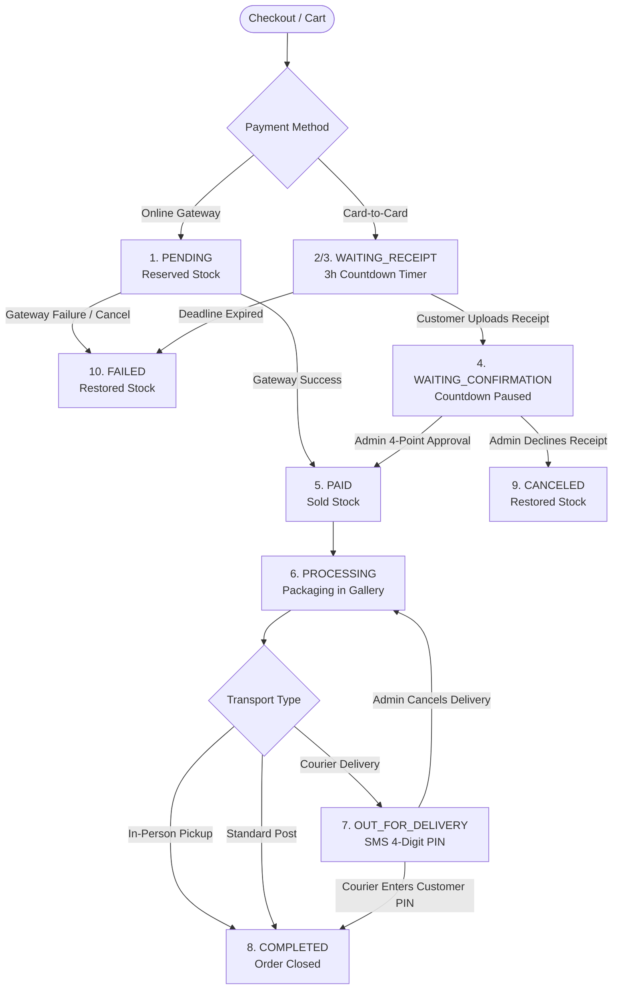

# Invoice Flow & Status Lifecycle

Comprehensive technical reference for human developers and AI assistants regarding the checkout, invoice, and order management lifecycle across customer dashboard, admin panels, and order fulfillment boards.

---

## 1. Overview & Core Architecture

Every customer purchase in Zhonella revolves around the `App\Models\Invoice` model. An invoice can be paid online via payment gateway or offline via bank card-to-card transfer.

### Relevant Models & Services
- **`App\Models\Invoice`**: Core order record storing financial totals, status, shipping address, transport method, and metadata.
- **`App\Models\Payment`**: Associated payment attempt records (`CARD`, `ONLINE`, `CASH`, `CREDIT`, etc.).
- **`App\Models\PaymentReceipt`**: Uploaded receipt images or PDFs submitted by the customer for offline transfers.
- **`App\Models\Order`**: Line items representing purchased products and quantities.
- **`App\Models\Quantity`**: Individual physical pieces of jewelry (`QuantityPieceStatus`).
- **`App\Services\DeliveryService`**: Dispatches couriers, generates delivery PINs, validates delivery codes, and executes status transitions.
- **`App\Services\ProductPriceCalculator`**: Recalculates product stock aggregates and maintains live quoted gold prices.
- **`App\Console\Commands\ExpireOfflineInvoices`**: Scheduled background worker (`offline:expire`) that fails overdue unpaid offline invoices and restores inventory.
- **`App\Console\Commands\CaptureInvoiceWorkflowScreenshots`**: Automated visual harness capturing high-resolution customer and admin screenshots for all lifecycle states.

---

## 2. Status Architecture: Database vs Display Statuses

The system distinguishes between **Database Statuses** (saved in `invoices.status`) and **Display Statuses** (computed dynamically via `$invoice->displayStatusKey()`):

### Database Statuses (`invoices.status`)

| Database Status | Description | Is Active? | Stock State |
|---|---|:---:|---|
| `PENDING` | Initial state for online payment checkout. | Yes | Reserved (`QuantityPieceStatus::Reserved`) |
| `AWAITING_PAYMENT` | Offline order placed. Waiting for customer transfer and receipt. | Yes | Reserved (`QuantityPieceStatus::Reserved`) |
| `PAID` | Payment confirmed by gateway or accepted by admin. | Yes | Marked Sold (`QuantityPieceStatus::Sold`) |
| `PROCESSING` | Payment accepted; shop staff packaging/preparing order. | Yes | Marked Sold (`QuantityPieceStatus::Sold`) |
| `OUT_FOR_DELIVERY` | Handed over to courier; 4-digit PIN dispatched to buyer. | Yes | Marked Sold (`QuantityPieceStatus::Sold`) |
| `COMPLETED` | Delivered to customer (PIN verified or confirmed). Order closed. | No | Final Sold (`QuantityPieceStatus::Sold`) |
| `FAILED` | Payment deadline expired without receipt, or online transaction failed. | No | Restored (`QuantityPieceStatus::Available`) |
| `CANCELED` | Order canceled by administrator or customer. | No | Restored (`QuantityPieceStatus::Available`) |

### Virtual / Display Statuses (`$invoice->displayStatusKey()`)

When an invoice is in `AWAITING_PAYMENT` or `PENDING`, the user-facing status splits based on whether the customer has submitted a receipt:

- **`WAITING_RECEIPT`**: The customer has not uploaded a receipt yet (`!$invoice->hasUploadedReceipt()`).
- **`WAITING_CONFIRMATION`**: The customer uploaded at least one receipt; pending admin review (`$invoice->hasUploadedReceipt()`).
- For all other statuses (`PAID`, `PROCESSING`, `OUT_FOR_DELIVERY`, `COMPLETED`, `FAILED`, `CANCELED`), `displayStatusKey()` matches `invoices.status`.

### Status Helper Methods on `Invoice` Model

```php
Invoice::activeStatuses();     // [PENDING, AWAITING_PAYMENT, PAID, PROCESSING, OUT_FOR_DELIVERY]
Invoice::successfulStatuses(); // [PAID, PROCESSING, OUT_FOR_DELIVERY, COMPLETED]
Invoice::editableStatuses();   // Statuses admin can assign from form
Invoice::adminFilterStatuses();// Statuses shown in admin order filter dropdown

$invoice->isActive();          // bool: true if status is in activeStatuses()
$invoice->displayStatusKey();  // string: WAITING_RECEIPT, WAITING_CONFIRMATION, PAID, etc.
$invoice->statusLabel();       // string: localized Persian label via __($this->displayStatusKey())
$invoice->statusBadgeClass();  // string: Bootstrap 5 badge class matching status
```

---

## 3. The End-to-End Order Lifecycles



### Flow 1: Online Gateway Payment
1. **Checkout**: Customer initiates online payment. Invoice created in `PENDING` with reserved pieces.
2. **Success**: Gateway callback marks payment `SUCCESS`, moves invoice to `PAID`, pieces marked `SOLD`, and dispatches `InvoiceSucceed`.
3. **Failure**: Unsuccessful callback or exception triggers `Invoice::failPayment()`, moving invoice to `FAILED`, releasing reserved pieces back to `AVAILABLE`, and resynchronizing product aggregates.

### Flow 2: Offline Card-to-Card Payment
1. **Creation**: Order placed with `AWAITING_PAYMENT`.
2. **`WAITING_RECEIPT`**: Customer sees 3-hour live countdown (`data-deadline-countdown`), bank account details, and receipt upload button.
3. **`WAITING_CONFIRMATION`**: Once receipt is uploaded, countdown is paused and customer sees "Payment receipt is under review". Expiry command explicitly skips this order.
4. **Admin Approval**: Admin visits `dashboard/invoices/edit/{hash}`, completes 4-point verification checklist (Destination Account, Receipt Info Checked, Bank Verification, Zero Balance), and clicks **Approve Payment**. Invoice moves to `PAID`.
5. **Admin Decline**: Admin declines receipt with optional decline reason. Invoice moves to `CANCELED`, payment set to `CANCEL`, and reserved stock is immediately released.
6. **Automatic Expiry**: If no receipt is uploaded within 3 hours, `php artisan offline:expire` transitions invoice to `FAILED` and releases reserved stock.

### Flow 3: Shipping & Delivery
1. **`PROCESSING`**: Staff prepares and packages the jewelry.
2. **Courier Delivery**:
   - Transport requires delivery code (`requires_delivery_code = true`).
   - Admin assigns courier and dispatches order -> status becomes `OUT_FOR_DELIVERY`.
   - System generates random 4-digit PIN and sends SMS to customer.
   - Courier enters 4-digit PIN upon arrival -> delivery completed, invoice moves to `COMPLETED`, `InvoiceCompleted` event fired.
   - **Guardrail**: Admin cannot bypass courier PIN verification directly if courier delivery is active.
3. **In-Person Gallery Pickup (`pickup`)**:
   - Customer picks up item at store.
   - No courier required. Admin directly transitions invoice from `PROCESSING` to `COMPLETED`.

---

## 4. Primary Views & Visual Interface Guide

The application provides three primary interfaces for monitoring and interacting with invoices:

### 1. Customer Invoice View (`/invoice/{hash}`)
- **Header**: Back button to profile orders, Persian order number, and dynamic status badge.
- **Alert Banners**:
  - `WAITING_RECEIPT`: Yellow alert with countdown timer, bank credentials, and upload button.
  - `WAITING_CONFIRMATION`: Blue alert stating receipt is under review.
  - `PAID`: Green alert confirming payment success.
  - `OUT_FOR_DELIVERY`: Warning banner reminding customer of the 4-digit courier PIN.
  - `FAILED` / `CANCELED`: Informative alert indicating cancellation/expiry and stock release.
- **Order Details**: Breakdown of ordered pieces, weights, live prices, discounts, shipping address, and QR code.

### 2. Primary Admin Edit Invoice Page (`/dashboard/invoices/edit/{hash}`)
- **Top Summary**: Dynamic status banner, breadcrumb `#hash`, Persian deadline notice, auto-calculated total price.
- **5-Step Visual Stepper**:
  - Step 1: Payment (`پرداخت`)
  - Step 2: Payment review (`بررسی پرداخت`)
  - Step 3: Shipping (`ارسال`)
  - Step 4: Order delivery (`تحویل سفارش`)
  - Step 5: Completed (`تکمیل شده`)
- **Action Panels**:
  - Step 2 Receipt Review: Receipt image preview, amount, tracking number, uploaded sum vs invoice total, 4-point approval safeguard form, and decline button.
  - Step 3/4 Courier Dispatch: Transport selection, courier assignment, active delivery status, resend PIN button.
  - Customer History: Total paid, waiting, and failed orders for buyer.

### 3. Admin Order Board (`/dashboard/order-board`)
- **Purpose**: Operational dashboard for fulfillment staff to track order pipelines in real-time.
- **Scope Filters**: Active orders, Completed orders, All orders.
- **5 Progression Stages**:
  - `Payment`: Paid / Unpaid indicator.
  - `Confirm`: Payment verified by admin or gateway.
  - `Settle`: Zero balance check.
  - `Courier`: Dispatched / Awaiting courier pickup.
  - `Delivery`: Delivered / In transit.
- **Quick Actions**: Direct links to edit invoice, print invoice, and dispatch details.

---

## 5. Visual Documentation & Screenshots Catalog

An automated snapshot suite (`CaptureInvoiceWorkflowScreenshots`) generates dual-perspective HD screenshots (1400x1000) for all 10 invoice statuses plus the order board.

Files are stored in `storage/app/workflow-screenshots/` and published to `public/workflow-screenshots/`:

| # | Status Key | Status (Fa) | Customer View | Admin Edit View | Admin Detail View | Stock State |
|---|---|---|---|---|---|---|
| 01 | `PENDING` | در انتظار پرداخت آنلاین | `customer_01_pending.png` | `admin_edit_01_pending.png` | `admin_show_01_pending.png` | Reserved |
| 02 | `AWAITING_PAYMENT` | در انتظار پرداخت | `customer_02_awaiting_payment.png` | `admin_edit_02_awaiting_payment.png` | `admin_show_02_awaiting_payment.png` | Reserved |
| 03 | `WAITING_RECEIPT` | در انتظار ثبت فیش | `customer_03_waiting_receipt.png` | `admin_edit_03_waiting_receipt.png` | `admin_show_03_waiting_receipt.png` | Reserved |
| 04 | `WAITING_CONFIRMATION` | در انتظار تایید فیش | `customer_04_waiting_confirmation.png` | `admin_edit_04_waiting_confirmation.png` | `admin_show_04_waiting_confirmation.png` | Reserved |
| 05 | `PAID` | پرداخت شده | `customer_05_paid.png` | `admin_edit_05_paid.png` | `admin_show_05_paid.png` | Sold |
| 06 | `PROCESSING` | در حال بسته‌بندی | `customer_06_processing.png` | `admin_edit_06_processing.png` | `admin_show_06_processing.png` | Sold |
| 07 | `OUT_FOR_DELIVERY` | تحویل به پیک | `customer_07_out_for_delivery.png` | `admin_edit_07_out_for_delivery.png` | `admin_show_07_out_for_delivery.png` | Sold |
| 08 | `COMPLETED` | تکمیل شده | `customer_08_completed.png` | `admin_edit_08_completed.png` | `admin_show_08_completed.png` | Sold |
| 09 | `CANCELED` | لغو شده | `customer_09_canceled.png` | `admin_edit_09_canceled.png` | `admin_show_09_canceled.png` | Restored |
| 10 | `FAILED` | ناموفق / منقضی | `customer_10_failed.png` | `admin_edit_10_failed.png` | `admin_show_10_failed.png` | Restored |
| -- | **Order Board** | تابلوی سفارشات | — | `admin_order_board.png` | `dashboard/order-board` | Active Pipeline |

Interactive browser gallery: `http://zhonella.test/workflow-screenshots/index.html`

---

## 6. Workflow Gaps Resolution

All identified operational gaps have been resolved:

### Gap 1: In-Person Gallery Pickup on the Order Board [RESOLVED]
- **Previous Issue**: The Order Board displayed courier-centric stages for all orders, even when `delivery_type = 'pickup'`.
- **Resolution**: `OrderBoardController` detects `isPickup()`, displaying `تحویل حضوری در گالری` (`In-person gallery pickup`) and `در انتظار مراجعه مشتری به گالری` (`Awaiting customer visit to gallery`) with gallery pickup icons (`ri-store-2-fill`).

### Gap 2: Processing Status Banner in Customer View [RESOLVED]
- **Previous Issue**: When transitioning to `PROCESSING`, no reassurance banner was displayed to the customer.
- **Resolution**: Added reassurance banner in `client/customer/invoice.blade.php`: `سفارش شما تایید شده و در حال بسته‌بندی در انبار است` (`Your order is confirmed and being prepared in the warehouse.`) and completion banner for `COMPLETED`.

### Gap 3: Request Re-Upload vs Permanent Cancellation [RESOLVED]
- **Previous Issue**: Declining a blurry receipt permanently canceled the invoice and released reserved gold pieces.
- **Resolution**: Added two distinct admin actions in `admin/invoices/invoice-form.blade.php`:
  1. **Request Receipt Re-upload**: Extends deadline by 3 hours, stores decline reason in invoice meta, removes unreadable receipt files, returns status to `WAITING_RECEIPT`, preserves reserved stock, and informs the customer on the invoice view with the decline reason.
  2. **Decline & Cancel**: Terminal cancellation releasing reserved stock.

### Gap 4: Courier PIN vs Postal Dispatch vs Gallery Pickup [RESOLVED]
- **Previous Issue**: Customer invoice showed courier PIN warnings even for standard post deliveries and gallery pickups.
- **Resolution**: Customer invoice view checks `$invoice->isPickup()`, `$invoice->requiresDeliveryCode()`, and standard delivery, showing the appropriate banner (gallery pickup, courier 4-digit PIN, or postal dispatch).

### Gap 5: Online Payment Retry with Stock Re-reservation [RESOLVED]
- **Previous Issue**: Failed online payments had no direct retry mechanism on customer invoice view and could lead to race conditions if retried after stock release.
- **Resolution**: Added `canRetryOnlinePayment()` on `Invoice`, "Pay online now" / "Retry payment" buttons on customer invoice view, and atomical piece availability checking with re-reservation to `Sold` upon retry in `ClientController::pay()`.

---

## 7. Automated Test Suites

All state transitions and inventory safeguards are validated by 114 automated tests (`php artisan test --filter=Invoice`):

- **`Tests\Feature\InvoiceWorkflowGapsResolutionTest`**: Verification of all 5 gap resolutions (gallery pickup board labels, customer reassurance banners, receipt re-upload flow with deadline extension, dispatch alert branching, and online payment retry stock re-reservation).
- **`Tests\Feature\InvoiceLifecycleTransitionTest`**: Complete 10-status traversal, online payment, offline receipt 4-point approval, courier PIN verification, in-person pickup, decline, and expiration.
- **`Tests\Feature\InvoiceStockRestorationTest`**: Stock release idempotency, multiple order piece releases, aggregate recalculation, and cross-invoice inventory isolation.
- **`Tests\Feature\InvoiceLifecycleAdversarialChallengerTest`**: Invalid PIN attempts, courier lockout after 5 failed tries, unauthorized courier protection, and guardrail enforcement.
- **`Tests\Feature\ViewAndUiEmpiricalVerificationTest`**: Modal checklist field verification, zero-balance enforcement, and view rendering across statuses.
- **`Tests\Feature\CustomerInvoiceViewTest`**: Customer dashboard tab synchronization, countdown timer, and localization keys.
- **`Tests\Feature\PaymentReceiptTest`**: Receipt confirmation, expiration bypass for uploaded receipts, and receipt filtering.
