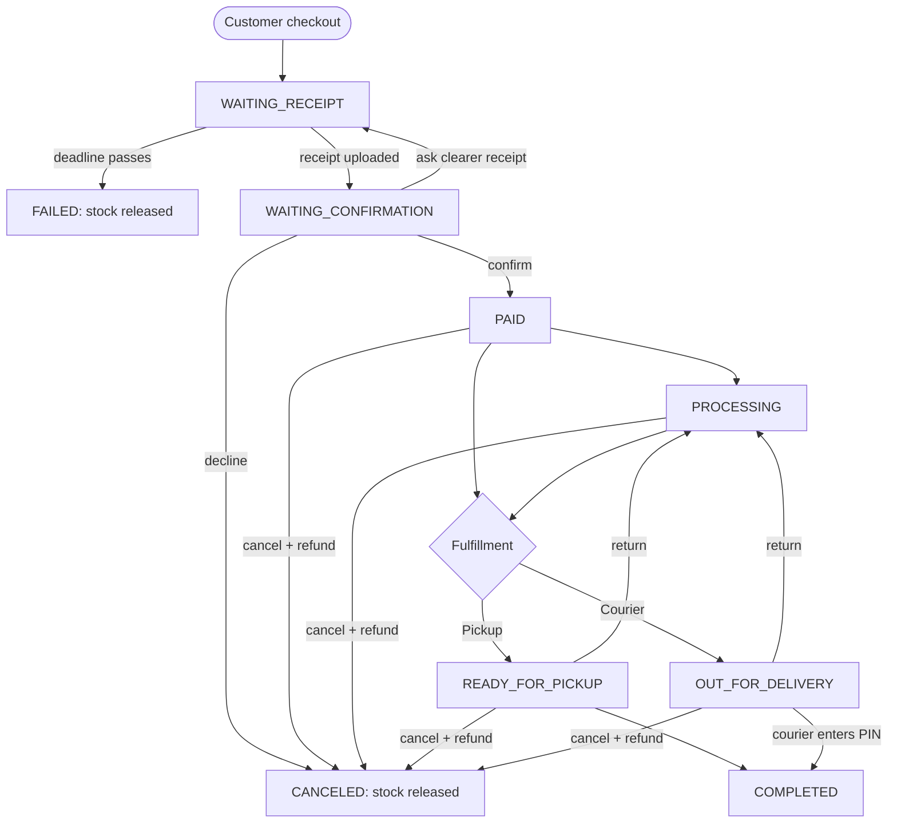

# Invoice Flow & Status Lifecycle

Technical reference for checkout, invoice, cancel and refund, and fulfillment. Payment is card-to-card only. Delivery is store pickup or courier only.

---

## 1. Core pieces

| Piece | Role |
|---|---|
| `App\Models\Invoice` | Order record: totals, status, delivery type, meta. |
| `App\Models\Payment` | Payment attempt. Checkout creates one `CARD` payment in `PENDING`. |
| `App\Models\PaymentReceipt` | Receipt files and details uploaded by the customer. |
| `App\Models\Order` / `Quantity` | Line items and the physical pieces. |
| `App\Models\Delivery` | One courier assignment, with a hashed 4-digit code. |
| `App\Models\Credit` | Ledger row for every wallet credit change. |
| `App\Services\CheckoutService` | Creates the invoice from the cart (`/card`). |
| `App\Services\InvoiceWorkflow` | Read-only rules: steps, current step, allowed moves. |
| `App\Services\DeliveryService` | Applies admin status moves, dispatches couriers, checks the PIN. |
| `App\Services\InvoiceCancellationService` | Cancels an invoice and refunds to wallet credit. |
| `App\Services\CreditService` | The only code that changes `Customer::credit`. |
| `php artisan offline:expire` | Runs every 15 minutes. Fails invoices with no receipt after the deadline. |

---

## 2. Statuses

`invoices.status` is the stored value. `displayStatusKey()` splits unpaid invoices by receipt.

| Status | Meaning | Active |
|---|---|:---:|
| `AWAITING_PAYMENT` | Created at checkout. Waiting for receipt or review. | Yes |
| `PAID` | Admin confirmed the payment. | Yes |
| `PROCESSING` | Admin started preparing the order. | Yes |
| `READY_FOR_PICKUP` | Pickup only. Waiting for the customer in the store. | Yes |
| `OUT_FOR_DELIVERY` | Courier only. A courier was assigned and the customer got a 4-digit code. | Yes |
| `COMPLETED` | Collected or delivered. | No |
| `FAILED` | No receipt before the deadline. | No |
| `CANCELED` | Declined or canceled by an admin. | No |

`PENDING` is a leftover value. Checkout no longer creates it.

Display keys: `AWAITING_PAYMENT` shows as `WAITING_RECEIPT` (no receipt yet) or `WAITING_CONFIRMATION` (receipt uploaded).

Stock: pieces are marked `Sold` at checkout, with no separate "reserved" state. `FAILED` and `CANCELED` call `markAvailable()` to release them.

---

## 3. Flow

```mermaid
flowchart TD
    Checkout([Customer checkout]) --> WR[WAITING_RECEIPT]
    WR -- deadline passes --> Failed[FAILED: stock released]
    WR -- receipt uploaded --> WC[WAITING_CONFIRMATION]
    WC -- ask clearer receipt --> WR
    WC -- decline --> Canceled[CANCELED: stock released]
    WC -- confirm --> Paid[PAID]
    Paid --> Processing[PROCESSING]
    Paid --> Type{Fulfillment}
    Processing --> Type
    Type -- Pickup --> Ready[READY_FOR_PICKUP]
    Type -- Courier --> Out[OUT_FOR_DELIVERY]
    Ready --> Completed[COMPLETED]
    Out -- courier enters PIN --> Completed
    Ready -- return --> Processing
    Out -- return --> Processing
    Paid -- cancel + refund --> Canceled
    Processing -- cancel + refund --> Canceled
    Ready -- cancel + refund --> Canceled
    Out -- cancel + refund --> Canceled
```

### Checkout
- Pickup or a Tehran address. Other provinces are blocked.
- A third-party recipient is allowed for delivery.
- An active bank account must exist.
- The invoice is created in `AWAITING_PAYMENT` with one pending `CARD` payment.

### Payment
1. The customer sees a countdown (`offline_payment_hours` setting, default 3) and uploads a receipt.
2. The expiry command skips invoices that have a receipt.
3. Admin review has three actions:
   - **Confirm**: needs a bank account, three checks and a zero balance. Status becomes `PAID`.
   - **Ask for a clearer receipt**: deletes the receipt files, extends the deadline, status goes back to `WAITING_RECEIPT`. The stock stays held.
   - **Decline and cancel**: status becomes `CANCELED` and stock is released. No refund, because no payment was confirmed.

### Fulfillment
- **Pickup**: `PAID` or `PROCESSING` → `READY_FOR_PICKUP` → `COMPLETED`.
- **Courier**: `PAID` or `PROCESSING` → `OUT_FOR_DELIVERY` (admin picks a courier, the customer gets a 4-digit code by SMS). The courier accepts the delivery, then enters the code. The invoice becomes `COMPLETED`.
  - Five wrong codes lock the delivery. The admin can resend a code, reassign the courier, or return the order to `PROCESSING`.
  - A courier reject or fail also returns the invoice to `PROCESSING`.
  - An admin cannot complete a courier invoice without the code.
- **Old postal invoices** (transport without a code) can still be completed directly from the edit page.

### Cancel and refund
- Allowed from `AWAITING_PAYMENT`, `PAID`, `PROCESSING`, `READY_FOR_PICKUP` and `OUT_FOR_DELIVERY`. Not from `COMPLETED`, `FAILED` or `CANCELED`.
- The admin must give a reason.
- In one transaction it closes open deliveries, sets `CANCELED`, releases stock, and writes the cancel details to `meta`.
- If the invoice was `PAID` or later, the full `total_price` is added to the customer credit and a `Credit` row is written. `meta.refunded_amount` blocks a second refund.
- The customer gets an SMS.
- Removing a single item from a paid invoice refunds that item through the same `CreditService`.

> [!WARNING]
> Customers cannot spend wallet credit at checkout yet. A refund only raises the balance.

---

## 4. Transition guard

`InvoiceWorkflow::canMove()` is called by `DeliveryService::applyAdminStatus()`.

- The edit form can only submit `PROCESSING`, `READY_FOR_PICKUP`, `OUT_FOR_DELIVERY` or `COMPLETED`.
- Payment statuses are never set from the form.
- A closed invoice cannot be reopened. This prevents selling released stock twice.
- Cancel and fail are always allowed from non-final states, through the cancel and decline actions only.

---

## 5. Screens

### Customer: `/card` and `/invoice/{hash}`
`/card` starts checkout. The invoice page shows a banner per state: countdown and upload (waiting receipt), under review, paid, preparing, ready for pickup, courier code reminder, completed, canceled or failed.

### Admin edit: `/dashboard/invoices/edit/{hash}`
- **Header**: number, status, fulfillment type, total, board, shipping label, print, cancel.
- **Stepper**: four steps. Payment, receipt review, preparing, customer pickup or courier delivery.
- **What to do now**: one title and one help line.
- **Panel for the current step only**:
  - Step 1: payment info, deadline, re-upload or decline notice.
  - Step 2: receipt table, totals, the approval checks, re-upload and decline.
  - Step 3: pickup place and "Mark ready", or courier select and "Send for delivery".
  - Step 4: "Mark as collected", or courier status with resend, reassign and return.
- **Side column**: customer, address or pickup place (hidden until payment is reviewed), notes.
- **Items table**.

### Admin order board: `/dashboard/order-board`
Scopes: active, completed, all. Five stages: payment, confirm, settle (receipt total vs invoice total), fulfillment (pickup or courier), handover.

---

## 6. Tests

`php artisan test` runs 498 tests. Key files:

- `InvoiceCancellationRefundTest`: refund per status, no double refund, delivery closed, rollback rules.
- `AdminInvoiceTransitionGuardTest`: illegal moves rejected, step mapping.
- `InvoiceLifecycleTransitionTest`, `InvoiceLifecycleAdversarialChallengerTest`: full lifecycle and PIN lockout.
- `InvoiceStockRestorationTest`: stock release and no reopening of failed invoices.
- `AdminInvoiceDeliveryTest`, `AdminInvoiceReceiptReviewTest`, `PaymentReceiptTest`: edit page, review and receipts.
- `CustomerInvoiceViewTest`, `ViewAndUiEmpiricalVerificationTest`: customer view and translation audit.

---

## 7. Known gaps

- Wallet credit cannot be spent at checkout.
- An invoice with an uploaded receipt never expires. An unreviewed receipt holds the stock until an admin acts.
- Re-upload deletes the old receipt files with no archive.
- The order board still has a postal branch for old invoices only.
- `resources/sass/panel/_invoice.scss` still has unused stepper rules.
